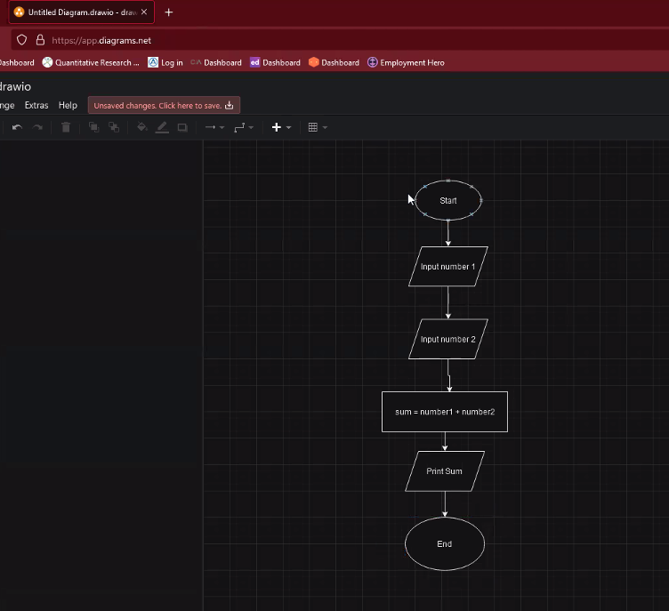
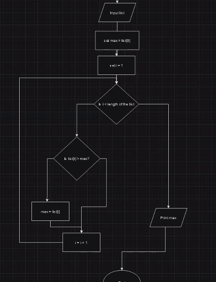

## Flow chart: 

- Oval = start / end
- Rectangle = Process / step
- Diamond: Decision point
- Parallelogram: Input / output
- Arrow: Flow

## Example 1: Calculate the sum of 2 numbers

## example 2: find the maximum number in a list

